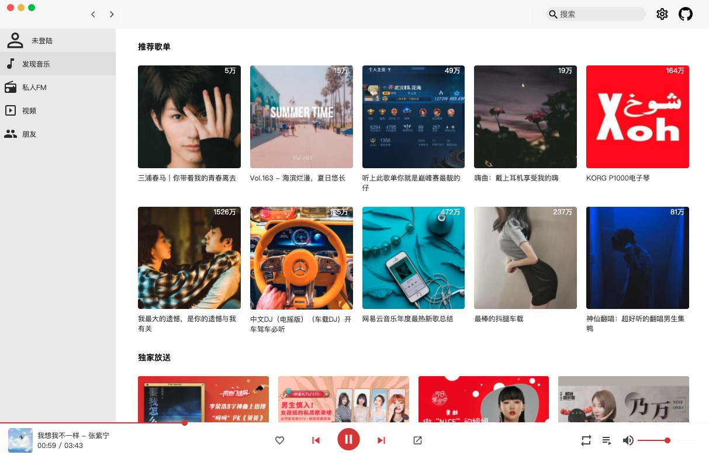

# nete-music
基于Vue2, vue-router, vuex全家桶开发的网页版播放器。
网易云音乐后端API，本项目仅供学习使用。

感谢 [NeteaseCloudMusicApi](https://binaryify.github.io/NeteaseCloudMusicApi) 后端大佬API贡献！




```
nete-music
├── LICENSE
├── NeteaseCloudMusicApi
├── README.md
├── docs
└── frontend
```

## 说明

- NeteaseCloudMusicApi 后端
- frontend 前端


## 技术栈

- vue2 vuecli创建
- vue-router
- vuex
- scss
- axios
- xgplay
- es6


## 使用说明

本地运行需要后端支持。

```bash
# 后端
cd NeteaseCloudMusicApi
npm install
npm start

# 前端
cd frontend
npm install
npm start

```

本地URL: http://localhost:8080/#/discovery


## 功能

- [x] 最新音乐
- [ ] 推荐歌单
- [ ] 推荐MV
- [ ] 推荐电台
- [ ] 独家放送